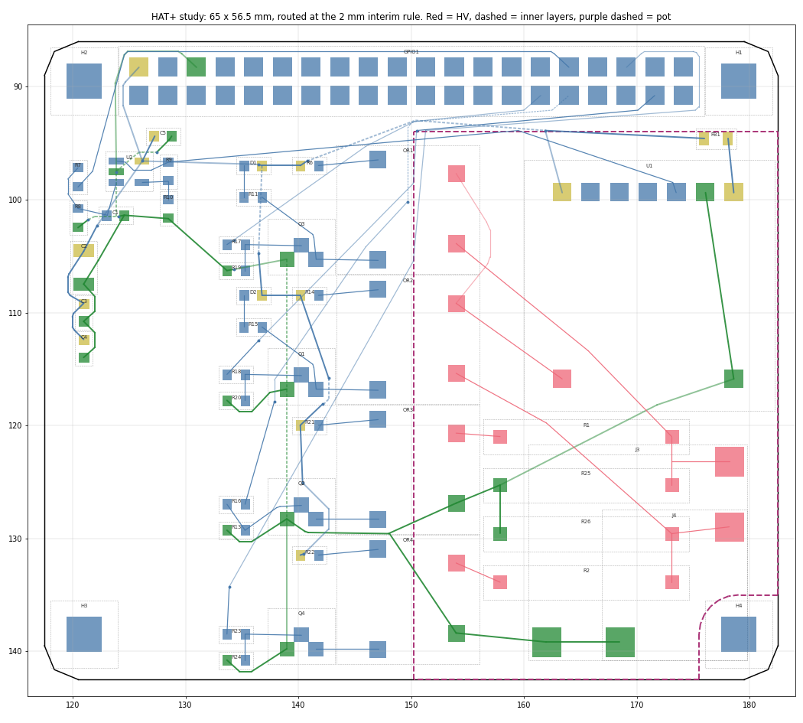

# HAT+ outline placement study (issue #4)

**Question (ADR-0004):** does the 2-channel active-discharge circuit fit the standard 65 x 56.5 mm
HAT+ outline once the HV zone is potted (ADR-0003)?

**Answer:** yes, at the ADR-0003 interim rules. A full placement routes with zero KiCad DRC errors
and zero unconnected items at 2 mm HV spacing, and the same placement still routes cleanly at 3 mm.
This is a feasibility result from a scripted router, not a finished layout (see "Not shown").

## Setup

- Outline 65 x 56.5 mm with 3 mm corners. The four holes (58 x 49 mm pattern) and the 40-pin header
  stay where rev A had them, which is already the HAT+ position.
- Rules (ADR-0002, ADR-0003 interim): HV copper on F.Cu/B.Cu only; In1/In2 voided under the pot; HV
  copper at least 3 mm inside the pot edge; 2 mm HV clearance (also run at 3 mm); 0.5 mm copper to
  board edge; pot notched around the H4 screw (3.5 mm radius).
- Changes from rev A:
  - J3/J4 screw terminals replaced by soldered-lead pads (2.6 mm pad, 1.3 mm drill). The HV pads sit
    next to the HV resistors; the return pads sit on GND near the bottom edge. ADR-0003 rules out
    terminals inside the pot.
  - U1 rotated so its LV pin row faces the header and HV pin 8 is at its lower-left corner.
  - Optos in one column, LED pins facing the drivers, HV pins facing the HV zone.
  - The four HV resistors stacked under U1.
  - Each MOSFET driver cluster aligned with its opto.
  - +5V bulk caps C2 to C4 moved to the power entry by header pins 2 and 4. They were boxed in when
    placed next to U1, and ADR-0001 only requires them on +5V before the ferrite.

## Results

| | 2 mm interim | 3 mm sensitivity |
|---|---|---|
| Connections routed by the study router | all | all |
| KiCad DRC errors (kicad-cli 10.0.1) | 0 | 0 |
| Unconnected items | 0 | 0 |
| Vias (HV vias) | 21 (0) | 22 (0) |
| Smallest HV copper to pot edge | 3.00 mm | 3.00 mm |
| Smallest HV to non-HV distance through the board (`tools/HvInterlayer.py`) | 2.08 mm, about 2.4 kV/mm at 5 kV | 2.60 mm, about 1.9 kV/mm |
| Pot area | 1516 mm2 per face, 41 % of the board | same |

For comparison, rev A's smallest through-board distance is 1.91 mm.

## Not shown, and open items

1. **Routing quality.** The router proves the nets fit; it does not produce a layout to fabricate.
   A hand pass in pcbnew should take the GPIO lines that still cut across the pot's top-left
   corner out of the pot (they pass HV_RAIL at the 2 mm minimum), pour GND instead of the long GND
   tracks, and fix the silkscreen.
2. **Pot process.** U1's HV pin 8 is under the module body, so the potting has to fill under the
   module, or the module needs standoffs. The qualification test (ADR-0003 prerequisite 3) has to
   cover that spot.
3. **Bottom pot vs the Pi 5.** The THT HV joints put pot on the bottom face too. Its thickness against
   the 16 mm standoff height recommended by HAT+ is not checked; the Pi 5 drawing gives no
   component heights.
4. **Schematic.** Adopting this needs J3/J4 footprints changed to the soldered-lead pads (new
   footprint in `HV_Pi_Hat.pretty`). Everything else is layout only.
5. **ID EEPROM.** Not placed. There is free area on the left (about x 118 to 132, y 115 to 135) near
   ID_SD/ID_SC.
6. **Spacing basis.** 2 mm is the interim rule. The real number comes from IEC 60664-3 Table 1 (ADR-0003
   prerequisite 1); the 3 mm run shows the placement has headroom.

## Reproduce

From this directory, with the KiCad 10 python (`/c/Program Files/KiCad/10.0/bin/python.exe`):

    python StudyBoard.py "../../HV Pi Hat.kicad_pcb"    # rev A board -> hatplus.kicad_pcb, placed
    python AutoRoute.py hatplus.kicad_pcb 2.0            # route at 2 mm (use a copy with a 3 mm .kicad_dru for 3.0)
    kicad-cli pcb drc --severity-all --format json -o drc_hatplus.json hatplus.kicad_pcb
    python ../../tools/HvInterlayer.py hatplus.kicad_pcb
    python ../../tools/PotMargin.py hatplus.kicad_pcb

`Layout.py` holds the placement. `hatplus.kicad_pro` and `hatplus.kicad_dru` are copies of the main
project's, so the netclasses and HV rules resolve. Footprint-library warnings in DRC are expected
here: the study folder has no library tables.

## Suggested next step

Promote this placement to the main board as rev B: add the soldered-lead footprint and update J3/J4
in the schematic, apply `Layout.py` to the main board, route, then do the hand pass from item 1 and
re-run DRC, `tools/HvInterlayer.py` and `tools/PotMargin.py`.
